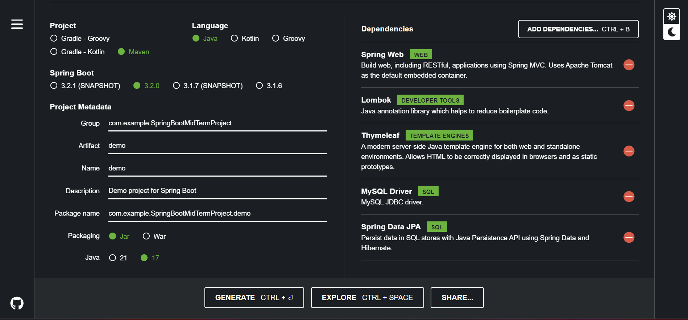
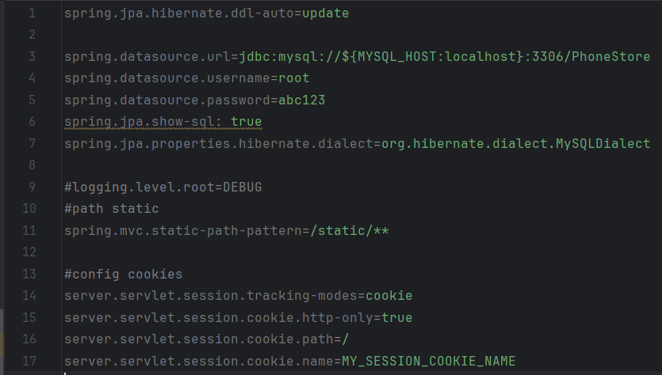
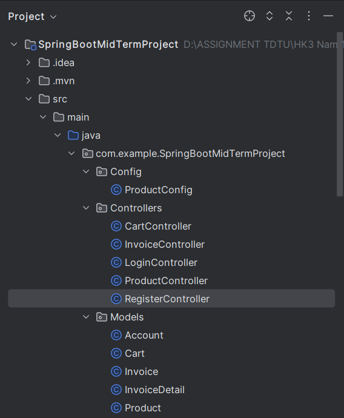
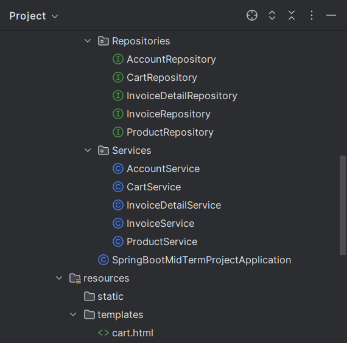
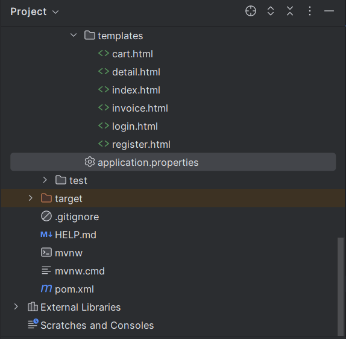

# Tổng quan về dự án

Mục đích của dự án là xây dựng một ứng dụng mua sắm trực tuyến đơn giản để bán sản phẩm một cách nhanh chóng. 

## Một số chức năng chính
- Đăng nhập vào ứng dụng bằng 1 trong 2 tài khoản: 
    - **Tài khoản: user1, mật khẩu: user1abc**
    - **Tài khoản: user2, mật khẩu: user2abc**
- Hiển thị tất cả sản phẩm mà khách hàng có thể lọc và tìm kiếm sản phẩm dựa trên các tiêu chí khác nhau như chủng loại sản phẩm tên sản phẩm, giá cả.
- Nếu khách hàng tìm thấy sản phẩm mình thích, họ có thể xem thông tin chi tiết về sản phẩm đó và thêm sản phẩm đó vào giỏ hàng.
- Nếu khách hàng xác nhận thanh toán thì xuất hóa đơn và khách hàng thanh toán tất cả sản phẩm trong giỏ hàng bằng tiền mặt.
# Thực hiện dự án
Xây dựng ứng dụng Java Spring Boot cùng với  để thực hiện các chức năng của dự án. Dữ liệu của ứng dụng được lưu trữ trong MySQL.
## Tổng quan về các công nghệ sử dụng trong Java Spring Framework
Java Spring Framework là một framework phát triển ứng dụng Java mạnh mẽ và phổ biến.
### Java Spring Web
- Spring MVC (Model-View-Controller):
    - Controller: Xử lý yêu cầu từ người dùng và quyết định cách phản hồi.
    - Model: Đại diện cho dữ liệu và logic của ứng dụng.
    - View: Giao diện người dùng hiển thị dữ liệu được cung cấp bởi Model.
- RESTful Web Services:
    - Spring Web hỗ trợ phát triển RESTful web services thông qua Spring MVC.
    - Sử dụng annotations để đơn giản hóa việc tạo các RESTful endpoint.
- Spring Boot và Embedded Containers:
    - Spring Boot giúp tạo ra ứng dụng web độc lập và dễ triển khai.
    - Cung cấp các embedded containers như Tomcat, Jetty, và Undertow để triển khai ứng dụng một cách đơn giản.
- Thymeleaf và Template Engines:
    - Spring hỗ trợ sử dụng template engines như Thymeleaf để tạo giao diện người dùng.
    - Dễ tích hợp với Spring MVC và hỗ trợ các tính năng như thực hiện điều kiện, vòng lặp, và biểu thức.
- Spring Security:
    - Spring Web có tích hợp với Spring Security để cung cấp các tính năng xác thực và phân quyền.
    - Giúp bảo vệ ứng dụng khỏi các loại tấn công bảo mật.
- WebSocket:
    - Spring hỗ trợ WebSocket để xây dựng các ứng dụng thời gian thực.
    - Giúp xây dựng các ứng dụng chat, cập nhật dữ liệu trực tiếp, và các ứng dụng tương tác thời gian thực khác.
### Spring Data JPA
- JPA và ORM:
    - JPA là một API của Java để tương tác với cơ sở dữ liệu quan hệ.
    - Spring Data JPA sử dụng JPA để thực hiện ánh xạ giữa các đối tượng Java và bảng trong cơ sở dữ liệu.
- Repository Pattern:
    - Spring Data JPA thúc đẩy việc sử dụng Repository pattern, nơi các phương thức tiêu biểu cho các thao tác cơ bản với cơ sở dữ liệu được tự động tạo ra dựa trên tên của phương thức.
- Quản Lý Truy Vấn:
    - Sử dụng các quy ước đặt tên phương thức để tạo ra các câu truy vấn cơ sở dữ liệu mà không cần phải viết các truy vấn SQL chi tiết.
    - Cung cấp annotation như @Query để viết truy vấn tùy chỉnh nếu cần.
- Cơ Sở Dữ Liệu Nhiều Loại:
    - Spring Data JPA hỗ trợ nhiều loại cơ sở dữ liệu quan hệ thông qua việc tích hợp với các implementation JPA khác nhau như Hibernate, EclipseLink, và OpenJPA.
- Tích Hợp với Spring Boot:
    - Tích hợp dễ dàng với Spring Boot, giúp tự động cấu hình và cung cấp các tùy chọn mặc định cho các cài đặt JPA.
### Lombok
- Annotation-Based Code Generation:
    - Lombok sử dụng các annotation để sinh mã nguồn tự động cho các phương thức getter, setter, constructor, equals, hashCode, và toString.
- Getter và Setter Tự Động:
    - Sử dụng annotation @Getter và @Setter để tự động sinh các phương thức getter và setter cho các trường trong class.Constructor Tự Động:
    - Sử dụng annotation @NoArgsConstructor, @RequiredArgsConstructor, và @AllArgsConstructor để tự động sinh các constructor mặc định, constructor cho các trường bắt buộc, và constructor với tất cả các trường.

## Các bước thực hiện dự án
### Tạo ứng dụng Java Spring Boot
- Tạo ứng dụng Java Spring Boot với [start.spring.io](https://start.spring.io/)  

- Thêm depenency thymeleaf và kết nối spring jpa tại application.properties

- Tạo các lớp model sử dụng trong dự án.
- Tạo các repository liên kết tới database 
- Tạo các lớp service gồm các phương thức phục vụ cho việc truy xuất dữ liệu
- Tạo các controller gắn với các endpoint để xử lí các tác vụ trên ứng dụng
- Tạo các file html trong thư mục templates là các view mà người dùng có thể thấy trên ứng dụng 
### Cấu trúc dự án
- 
- 
- 
## Các bước để chạy và sử dụng ứng dụng
- Cài đặt MySQL Workbench 8.0 CE
- Thêm connection mới với 
    - **user: root, mật khẩu: abc123**
- Tạo database với tên là PhoneStore
- spring.datasource.url=jdbc:mysql://${MYSQL_HOST:localhost}:3306/PhoneStore
- Chạy và trải nghiệm các tính năng của ứng dụng